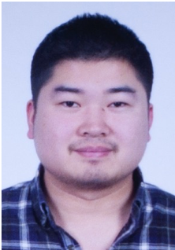

# PrecisionTECH Beijing [中文版本](README_CN.md)

## Introduction

PrecisionTECH(Beijing) Software Studio founded in 2010 by a group of engineers who love software design, software development and tuning. Since its establishment, it has undertaken more than 100 large and small software projects. Among these projects, the industries include media, civil aviation freight, aircraft maintenance industry, mobile payments, car ride hailing, hotels, education, e-commerce and other Internet areas. The software forms involved are Windows desktop software, browser-based server software, Android software, IOS software, and embedded system software. Currently, we focus on outsourcing development. The Studio has offices in Beijing and Pingxiang. It has more than 10 development engineers, mainly engaged in application development of IOS and Android and back-end development of PHP, java and .NET.

## Our teams

### Tom Chen

* Former [ENLIGHT MEDIA(SHE: 300251)](https://en.wikipedia.org/wiki/Beijing_Enlight_Media) Technical Director
* Senior front-end and back-end development engineer

#### Technology stacks

* PHP: symfony / Wordpress / Drupal
* Microsoft: C# / .NET CORE / ASP.NET MVC
* Database: MYSQL / SQLServer / PostgreSQL
* JS: Vuejs / Angularjs
* Flutter
* Vuejs + NativeScript

### Evacuee Xia

### Ethan Luo

## Our works

